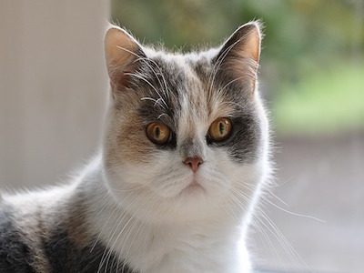

# 🖼️ Neural Style Transfer from Scratch (TensorFlow)

Transform your own images into mesmerizing works of art using **Neural Style Transfer**, implemented entirely **from scratch in TensorFlow**. This project combines deep learning and artistic expression by blending the **content** of one image with the **style** of another.

---

## Description

This repo showcases an end-to-end implementation of Neural Style Transfer (NST) based on the work by Gatys et al. It uses a pre-trained **VGG19** model to extract deep features and optimizes a new image to match the content of a content image and the style of a reference artwork.

## Features:
- Pure TensorFlow (no high-level APIs for training)
- Custom content/style loss functions
- Random noise + content image initialization
- Visualized training at multiple epochs
- Flexible configuration for images and layers

---

## Project Structure
```bash
neyral-style-transfer-tf/
│
├── notebook.ipynb # Full training and visualization notebook
│
├── images/
│ ├── content/ # Content images (e.g., cat.jpg, louvre.jpg)
│ ├── style/ # Style images (e.g., monet.jpg, sandstone.jpg)
│ └── output/ # Generated outputs during training
```
---


---

## Results

### Artistic Style Transfer Output Samples

| Content Image | Style Image | Stylized Output |
|---------------|-------------|-----------------|
|  |  |  |
|  |  |  |
|  |  |  |

---

### Side-by-Side Comparisons

These images show content, style, and output stitched together in one frame for better visual clarity.

- **Louvre + Monet Style**
  

- **Football + Water Drop Style**
  

- **Cat + Stone Style**
  

> You can explore more results in the [`images/output/`](images/output/) directory.

### Loss Curve

Track how the model improves over time with the training loss visualization:

- **Louvre-Monet NST Loss**
  
  

> The loss plot helps understand convergence and tuning behavior during optimization.
---

## How It Works

1. **Preprocess Images** – Resize and normalize input images.
2. **Feature Extraction** – Use VGG19 to extract content & style features.
3. **Loss Calculation** – Compute content and style losses from specific layers.
4. **Optimization** – Train the generated image via backpropagation using `tf.GradientTape`.
5. **Visualize Results** – Save intermediate outputs to see the style evolution.

---

## Key Customizations

**Style Layers** used:
  ```python
  STYLE_LAYERS = [
      ('block1_conv1', 0.2),
      ('block2_conv1', 0.2),
      ('block3_conv1', 0.2),
      ('block4_conv1', 0.2),
      ('block5_conv1', 0.2)
  ]

  Content Layer: block5_conv2

Loss Weights: alpha = 10, beta = 40 (customizable) 

```  
---

## 👨‍💻 Author

**Nabeel Shan**  
Software Engineering Student - NUST Islamabad  
Aspiring AI Researcher | AI/ML Enthusiast  
[LinkedIn](https://www.linkedin.com/in/nabeelshan) • [GitHub](https://github.com/nabeelshan78)  
- Currently focused on mastering CNNs, YOLO, and ResNet architectures.
- Mastering Deep Learning architectures through hands-on work
- Looking to collaborate on AI/ML projects or research opportunities
